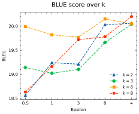
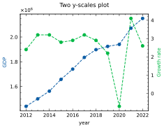
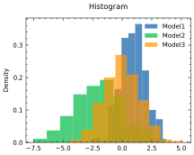
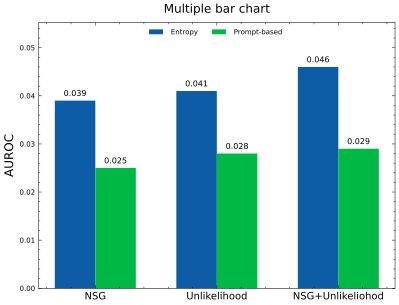
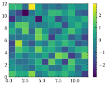
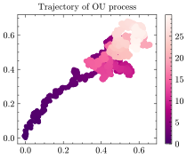

# MonetPlot
<div style="display: flex; align-items: center;">
  
  <div>
  <p style="font-family: 'Georgia', 'Times New Roman', serif; font-size: 18px; font-style: italic;">
  <strong>Transform your csv table into the figure!</strong>
</p>
</p>
  </div>
</div>

<h2 style="margin-top: 30px;">Plot</h2>

```python
monet = MonetPlot("new_data/BLEU_over_k.csv", xaxis=True, CI=False)

monet.plot(xlabel="Epsilon", ylabel="BLEU", marker="enum", linestyle="--",   
                title="BLUE score over k", legend=True, markersize=4, titlesize=10, path="figure.png")
```


    

    


### Custom color
Edit color in `style/style.py` and pass the custom arguement


```python
cycle=[
    "#FF7F50",
    "#008080",
    "#6A5ACD",
    "#808000",
    "#D3D3D3",
],
monet = MonetPlot("new_data/BLEU_over_k.csv", xaxis=True, CI=False, custom=True)

monet.plot(xlabel="Epsilon", ylabel="BLEU", marker="enum", linestyle="--",   
                title="BLUE score over k", legend=True, markersize=4, titlesize=10, path="figure.png")
```


    

    


```python
monet = MonetPlot("data/gdp.csv", xaxis=True, CI=False, label_axis='col')
monet.two_yscale_plot(xlabel="year", marker="o", linestyle="--", title="Two y-scales plot", markersize=4, path="figure2.png")
```


    

    


## Histogram


```python
monetplot = MonetPlot("data/gaussian.csv")
monetplot.histogram(density=True, ylabel="Density", title="Histogram", path="histogram")
```


    

    


## Bar Chart 
### Class gap ratio (cgr)과 width ratio (wr)을 조절해서 figure 생성 


```python
moneplot = MonetPlot("data/mbar.csv", xaxis=True, CI=False) 
moneplot.mutiple_bar(grid=False, xlabel="", ylabel="AUROC", cgr=1.1, wr=1.4, show_value=True, 
                    title="Multiple bar chart", titlesize=12, path="barchart.png")
```


    

    


```python
moneplot = MonetPlot("data/halu.csv", xaxis=True, CI=False) 
moneplot.mutiple_bar(grid=False, xlabel="", ylabel="AUROC", cgr=1.0, show_value=True, 
                    title="Multiple bar chart", titlesize=12, path="barchart.png")
```


    

    


## Miscellaneous


```python
matrix = np.random.standard_normal(size=(12,12))
MonetPlot.display_array(matrix, cmap="viridis")
```


    

    


```python
from ou_noise import ou 
t = np.arange(0, 30, 0.01)
x = ou.path(0.0, t, .4, 0.5, 0.05)
y = ou.path(0.0, t, .4, 0.5, 0.05)
MonetPlot.scatter(x,y,timestamp=t, title="Trajectory of OU process")
```


    

