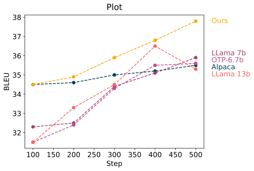
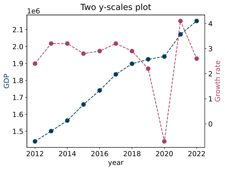
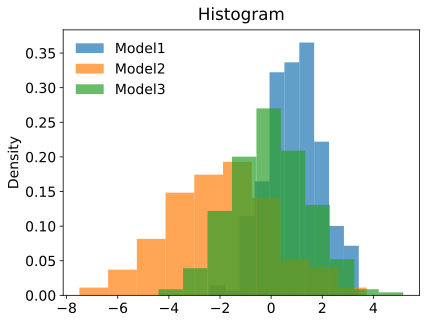
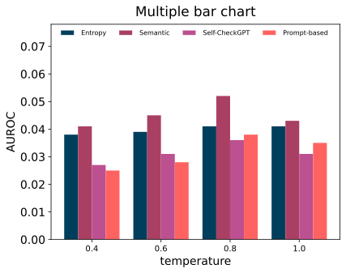
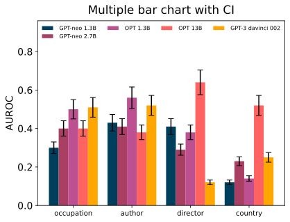
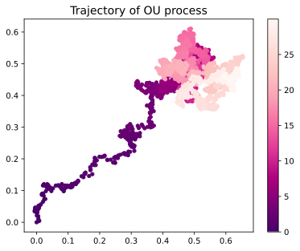

# Visualizer 👁‍🗨
## You can choose the color in <code>style/asahikawa.py</code> 
### Usage 
```python
pip install requirements.txt
from util import *
visualizer = Visualizer(csv_path, xaxis=True, CI=False)
```

```python
%matplotlib inline 
%reload_ext autoreload
%autoreload 2
from visualizer import * 
import pandas as pd
```

## Examples 1: plot 


```python
df = pd.read_csv("data/example.csv")
df
```


<div>
<style scoped>
    .dataframe tbody tr th:only-of-type {
        vertical-align: middle;
    }

    .dataframe tbody tr th {
        vertical-align: top;
    }

    .dataframe thead th {
        text-align: right;
    }
</style>
<table border="1" class="dataframe">
  <thead>
    <tr style="text-align: right;">
      <th></th>
      <th>Training step</th>
      <th>Alpaca</th>
      <th>LLama 7b</th>
      <th>OTP-6.7b</th>
      <th>Ours</th>
    </tr>
  </thead>
  <tbody>
    <tr>
      <th>0</th>
      <td>100</td>
      <td>34.5</td>
      <td>32.3</td>
      <td>31.5</td>
      <td>34.5</td>
    </tr>
    <tr>
      <th>1</th>
      <td>200</td>
      <td>34.6</td>
      <td>32.5</td>
      <td>32.4</td>
      <td>34.9</td>
    </tr>
    <tr>
      <th>2</th>
      <td>300</td>
      <td>35.0</td>
      <td>34.4</td>
      <td>34.3</td>
      <td>35.9</td>
    </tr>
    <tr>
      <th>3</th>
      <td>400</td>
      <td>35.2</td>
      <td>35.1</td>
      <td>35.5</td>
      <td>36.8</td>
    </tr>
    <tr>
      <th>4</th>
      <td>500</td>
      <td>35.5</td>
      <td>35.9</td>
      <td>35.6</td>
      <td>37.8</td>
    </tr>
  </tbody>
</table>
</div>


```python
visualizer = Visualizer("data/example.csv", xaxis=True, CI=False)
visualizer.plot(xlabel="Step", ylabel="BLEU", marker="o", linestyle="--", title="Plot")
```


    

    


## Example 2: plot with two-y scale 


```python
df = pd.read_csv("data/gdp.csv")
df
```


<div>
<style scoped>
    .dataframe tbody tr th:only-of-type {
        vertical-align: middle;
    }

    .dataframe tbody tr th {
        vertical-align: top;
    }

    .dataframe thead th {
        text-align: right;
    }
</style>
<table border="1" class="dataframe">
  <thead>
    <tr style="text-align: right;">
      <th></th>
      <th>지표</th>
      <th>2012</th>
      <th>2013</th>
      <th>2014</th>
      <th>2015</th>
      <th>2016</th>
      <th>2017</th>
      <th>2018</th>
      <th>2019</th>
      <th>2020</th>
      <th>2021</th>
      <th>2022</th>
    </tr>
  </thead>
  <tbody>
    <tr>
      <th>0</th>
      <td>GDP</td>
      <td>1,440,111.40</td>
      <td>1,500,819.10</td>
      <td>1,562,928.90</td>
      <td>1,658,020.40</td>
      <td>1,740,779.60</td>
      <td>1,835,698.20</td>
      <td>1,898,192.60</td>
      <td>1,924,498.10</td>
      <td>1,940,726.20</td>
      <td>2,071,658.00</td>
      <td>2,150,575.80</td>
    </tr>
    <tr>
      <th>1</th>
      <td>Growth rate</td>
      <td>2.4</td>
      <td>3.2</td>
      <td>3.2</td>
      <td>2.8</td>
      <td>2.9</td>
      <td>3.2</td>
      <td>2.9</td>
      <td>2.2</td>
      <td>-0.7</td>
      <td>4.1</td>
      <td>2.6</td>
    </tr>
  </tbody>
</table>
</div>


```python
visualizer = Visualizer("data/gdp.csv", xaxis=True, CI=False, label_axis='col')
visualizer.two_yscale_plot(xlabel="year", marker="o", linestyle="--", grid=False, title="Two y-scales plot")
```


    

    


# Histogram 


```python
d = pd.read_csv("data/gaussian.csv")
d
```


<div>
<style scoped>
    .dataframe tbody tr th:only-of-type {
        vertical-align: middle;
    }

    .dataframe tbody tr th {
        vertical-align: top;
    }

    .dataframe thead th {
        text-align: right;
    }
</style>
<table border="1" class="dataframe">
  <thead>
    <tr style="text-align: right;">
      <th></th>
      <th>Model1</th>
      <th>Model2</th>
      <th>Model3</th>
    </tr>
  </thead>
  <tbody>
    <tr>
      <th>0</th>
      <td>0.767819</td>
      <td>2.661800</td>
      <td>3.068371</td>
    </tr>
    <tr>
      <th>1</th>
      <td>1.682539</td>
      <td>-7.499532</td>
      <td>1.156142</td>
    </tr>
    <tr>
      <th>2</th>
      <td>1.282855</td>
      <td>-0.002031</td>
      <td>0.852627</td>
    </tr>
    <tr>
      <th>3</th>
      <td>-0.862114</td>
      <td>-3.798504</td>
      <td>-2.271575</td>
    </tr>
    <tr>
      <th>4</th>
      <td>1.743264</td>
      <td>-4.342685</td>
      <td>-1.426106</td>
    </tr>
    <tr>
      <th>...</th>
      <td>...</td>
      <td>...</td>
      <td>...</td>
    </tr>
    <tr>
      <th>235</th>
      <td>1.215906</td>
      <td>-0.095754</td>
      <td>0.310294</td>
    </tr>
    <tr>
      <th>236</th>
      <td>0.520963</td>
      <td>1.797419</td>
      <td>-1.364578</td>
    </tr>
    <tr>
      <th>237</th>
      <td>1.787524</td>
      <td>-2.658181</td>
      <td>-1.250294</td>
    </tr>
    <tr>
      <th>238</th>
      <td>0.401798</td>
      <td>-2.944445</td>
      <td>-0.528898</td>
    </tr>
    <tr>
      <th>239</th>
      <td>0.859232</td>
      <td>-3.043383</td>
      <td>0.223249</td>
    </tr>
  </tbody>
</table>
<p>240 rows × 3 columns</p>
</div>


```python
visualizer = Visualizer("data/gaussian.csv")
visualizer.histogram(density=True, ylabel="Density", title="Histogram")
```


    

    


# Multiple Bar Chart 
## csv 파일의 첫 번째 column은 카테고리를 나타네고 헤더는 모델을 나타냄  


```python
pd.read_csv("data/mbar.csv")
```


<div>
<style scoped>
    .dataframe tbody tr th:only-of-type {
        vertical-align: middle;
    }

    .dataframe tbody tr th {
        vertical-align: top;
    }

    .dataframe thead th {
        text-align: right;
    }
</style>
<table border="1" class="dataframe">
  <thead>
    <tr style="text-align: right;">
      <th></th>
      <th>type</th>
      <th>GPT-neo 1.3B</th>
      <th>GPT-neo 2.7B</th>
      <th>OPT 1.3B</th>
      <th>OPT 13B</th>
      <th>GPT-3 davinci 002</th>
    </tr>
  </thead>
  <tbody>
    <tr>
      <th>0</th>
      <td>occupation</td>
      <td>0.30</td>
      <td>0.40</td>
      <td>0.50</td>
      <td>0.40</td>
      <td>0.51</td>
    </tr>
    <tr>
      <th>1</th>
      <td>author</td>
      <td>0.43</td>
      <td>0.41</td>
      <td>0.56</td>
      <td>0.38</td>
      <td>0.52</td>
    </tr>
    <tr>
      <th>2</th>
      <td>director</td>
      <td>0.41</td>
      <td>0.29</td>
      <td>0.38</td>
      <td>0.64</td>
      <td>0.12</td>
    </tr>
    <tr>
      <th>3</th>
      <td>country</td>
      <td>0.12</td>
      <td>0.23</td>
      <td>0.14</td>
      <td>0.52</td>
      <td>0.25</td>
    </tr>
  </tbody>
</table>
</div>


```python
pd.read_csv("data/mbar_CI.csv") # file for confidence interval values 
```


<div>
<style scoped>
    .dataframe tbody tr th:only-of-type {
        vertical-align: middle;
    }

    .dataframe tbody tr th {
        vertical-align: top;
    }

    .dataframe thead th {
        text-align: right;
    }
</style>
<table border="1" class="dataframe">
  <thead>
    <tr style="text-align: right;">
      <th></th>
      <th>GPT-neo 1.3B</th>
      <th>GPT-neo 2.7B</th>
      <th>OPT 1.3B</th>
      <th>OPT 13B</th>
      <th>GPT-3 davinci 002</th>
    </tr>
  </thead>
  <tbody>
    <tr>
      <th>0</th>
      <td>0.030</td>
      <td>0.040</td>
      <td>0.050</td>
      <td>0.040</td>
      <td>0.051</td>
    </tr>
    <tr>
      <th>1</th>
      <td>0.043</td>
      <td>0.041</td>
      <td>0.056</td>
      <td>0.038</td>
      <td>0.052</td>
    </tr>
    <tr>
      <th>2</th>
      <td>0.041</td>
      <td>0.029</td>
      <td>0.038</td>
      <td>0.064</td>
      <td>0.012</td>
    </tr>
    <tr>
      <th>3</th>
      <td>0.012</td>
      <td>0.023</td>
      <td>0.014</td>
      <td>0.052</td>
      <td>0.025</td>
    </tr>
  </tbody>
</table>
</div>


```python
visualizer = Visualizer("data/mbar.csv", xaxis=True, CI=False) 
visualizer.mutiple_bar(grid=False, ylabel="AUROC", title="Multiple bar chart")
```


    

    


```python
visualizer = Visualizer("data/mbar.csv", xaxis=True, CI=True) 
visualizer.mutiple_bar(grid=False, ylabel="AUROC", title="Multiple bar chart with CI")
```


    

    


# Scatter 


```python
from ou_noise import ou 
t = np.arange(0, 30, 0.01)
x = ou.path(0.0, t, .4, 0.5, 0.05)
y = ou.path(0.0, t , .4, 0.5, 0.05)
Visualizer.scatter(x,y,timestamp=t, title="Trajectory of OU process")
```


    

    

